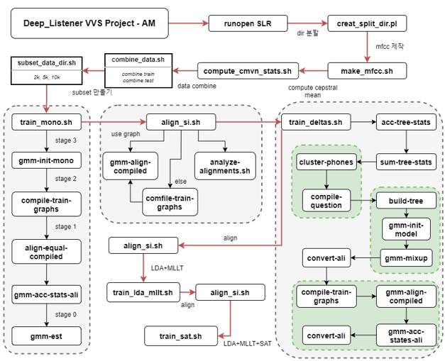
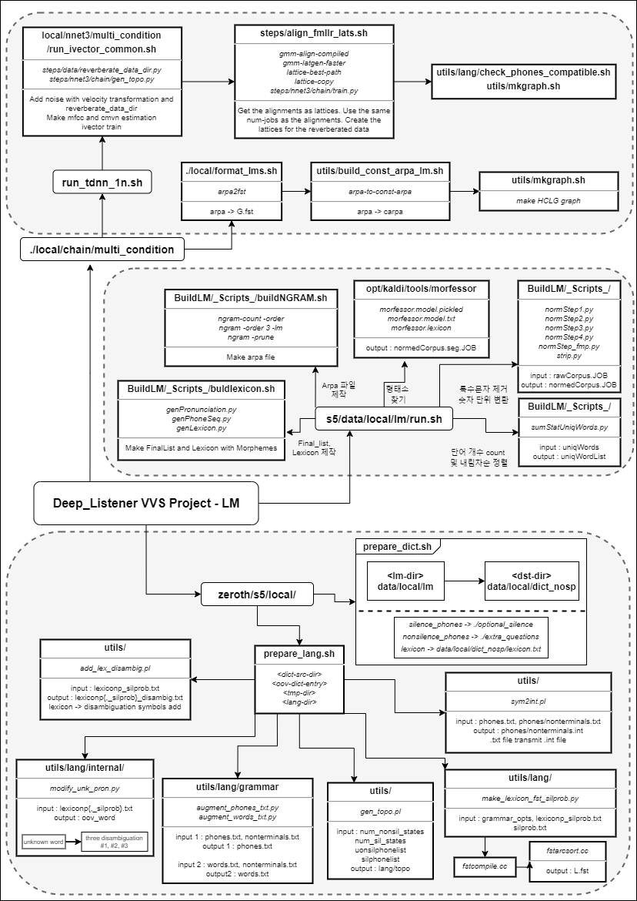

# Team Deep Listener

## 팀원

| 이름   | 전공           | 메일               |
| ------ | -------------- | ------------------ |
| 이찬현 | 건국대학교 전기전자공학부 | ech97@konkuk.ac.kr |
| 안진혁 | 건국대학교 전기전자공학부 | hijin99@konkuk.ac.kr |
| 김한비 | 건국대학교 전기전자공학부 | khb200718@konkuk.ac.kr   |
| 신지혜 | 건국대학교 전기전자공학부 | long0404@konkuk.ac.kr    |

## github Tree

## 구조

## 서버 구성도

![서버 구성도]

## 딥러닝 클라이언트 구조

![딥러닝들]

### E2E Text To Speech Model

### KADLI Speech To Text

### Korean Spacing Model

### KoBERT Sentimental Classification

## Requirement

ESPnet

Kaldi 

### Computing Power

> 

## TODOS

- server, client 고급화
- raspberryPi/src/client_text.py 코드 최적화
- Large HCLG graph 제작
