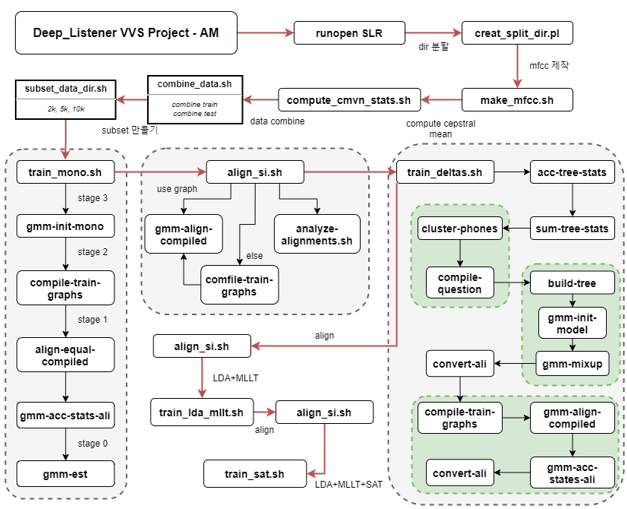
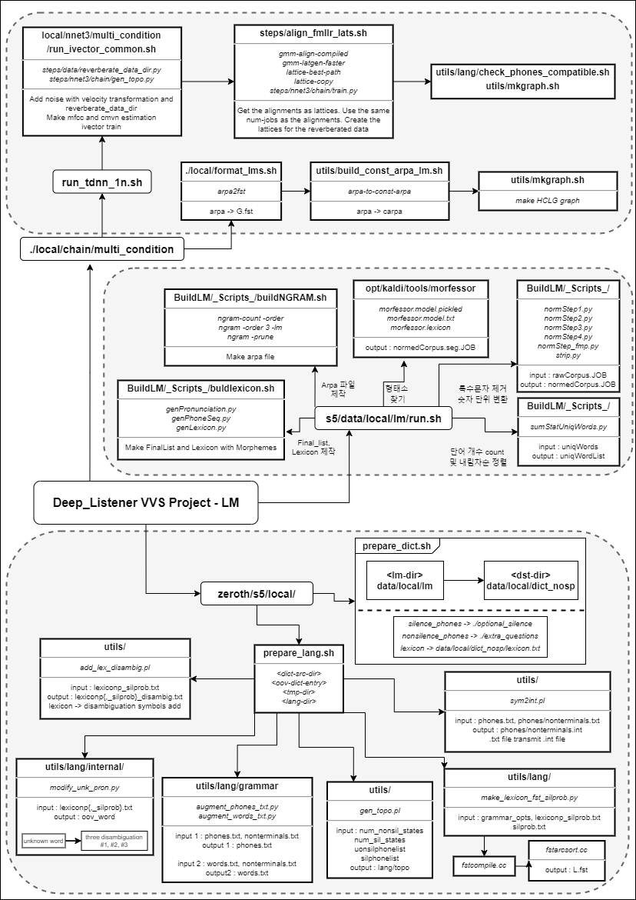
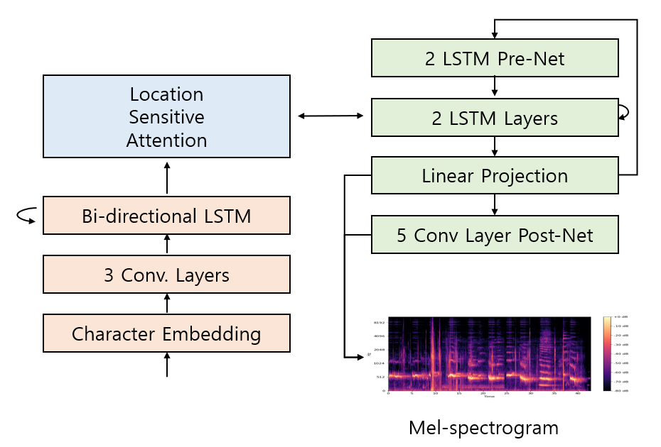
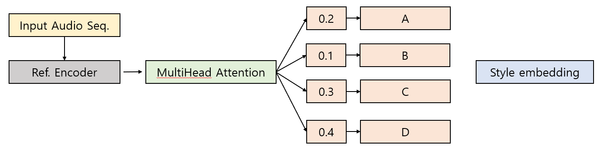
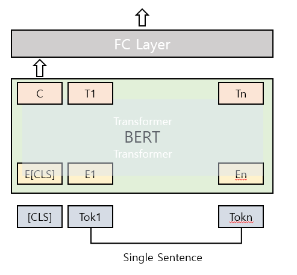

# Team Deep Listener

## 팀원

| 이름   | 메일               | 역할 |
| ------ | ------------------ | ------ |
| 이찬현 | ech97@konkuk.ac.kr | 기획, 총괄 및 개발<br/>Kaldi Phrase Hint 기능 개발<br/>Server 개발 |
| 안진혁 | hijin99@konkuk.ac.kr | kaldi Acoustic Model 최적화<br/>음성관련 딥러닝 클라이언트 개발<br/>Chatting 클라이언트 개발 |
| 김한비 | khb200718@konkuk.ac.kr   | kaldi Launguage model 최적화<br/>언어관련 딥러닝 클라이언트 개발 |
| 신지혜 | long0404@konkuk.ac.kr    | H/W개발 – 라즈베리파이 & 휴대폰 사운드 전송 시스템 구축<br/>3D Printing<br/>UI 개발 |


## github Tree

```bash
│  graph_AM.png
│  graph_LM.png
│  README.md
│  
├─design
│      base_image.png
│      base_image_n.png
│      base_image_re.png
│      chat.png
│      chat_n.png
│      client_text_designchange.py
│      Home_resize.png
│      login_resize.png
│      menu_resiz.png
│      setting.png
│      setting_re.png
│      
├─document
│  ├─etc
│  │      Call_Quality.md
│  │      shellScript.md
│  │      sox_sh.md
│  │      학습 새로 돌릴때 주의사항.md
│  │      
│  ├─kaldi
│  │      build LM.md
│  │      FST_Manufacturing_Principle.md
│  │      fst_summary.md
│  │      HMM_topology.md
│  │      Kaldi Data Preparation.md
│  │      Kaldi_add_grammars.md
│  │      kaldi_IO.md
│  │      
│  └─tmp
│          arpa2fst.md
│          extend_vocab_demo.sh.md
│          Prepare_Data.md
│          tcp_multi_client.cc
│          tmp
│          
├─esw2021
│  │  Deep Listener의 장점.md
│  │  hierarchy.drawio
│  │  그래프_찬현.md
│  │  일지.md
│  │                  
│              
├─home
│  ├─Sentimental
│  │      ECorpus_Test_out.csv
│  │      prepare_data.py
│  │      README.md
│  │      requirements.txt
│  │      run_sent.py
│  │      train.py
│  │      
│  ├─spacing
│  │      run_sentences.py.md
│  │      
│  └─TTS
│          run_tts.py.md
│          test_tts.py.md
│          
├─opt
│  │  allStart.sh.md
│  │  kusw_start.sh.md
│  │  tcp_start.sh.md
│  │  
│  ├─kaldi
│  │  ├─bin
│  │  │      arpa2fst.md
│  │  │      
│  │  ├─src
│  │  │  │  kaldi.mk.md
│  │  │  │  
│  │  │  └─online2bin
│  │  │          online2-tcp-nnet3-decode-faster-rev2.cc
│  │  │          online2-tcp-nnet3-decode-faster.cc.md
│  │  │          online2-tcp-nnet3-faster.cc
│  │  │          
│  │  └─tools
│  │      └─extras
│  │              install_mkl.sh.md
│  │              install_sequitur.sh.md
│  │              
│  ├─models
│  │      kusw_korean_nnet3.yaml.md
│  │      
│  └─zeroth
│      └─s5
│          │  extend_vocab_demo.sh.md
│          │  kusw_extend_lexicon.sh
│          │  kusw_extend_vocab_demo.md
│          │  path.sh.md
│          │  run_kspon.sh.md
│          │  run_openslr_rev1.sh
│          │  
│          ├─data
│          │  └─local
│          │      └─lm
│          │          │  run.sh.md
│          │          │  run_merge.sh.md
│          │          │  run_task.sh.md
│          │          │  
│          │          ├─buildLM
│          │          │  ├─_courpus_task_
│          │          │  │      baedal.txt
│          │          │  │      cafe.txt
│          │          │  │      
│          │          │  └─_scripts_
│          │          │          genPronunciation_cmu.py.md
│          │          │          
│          │          └─_scripts_
│          │                  genPronunciation_cmu.py
│          │                  
│          ├─img
│          │      Chanhyun1.png
│          │      Chanhyun2.PNG
│          │      Chanhyun3.PNG
│          │      Chanhyun4.png
│          │      Chanhyun5.PNG
│          │      Chanhyun6.PNG
│          │      
│          ├─local
│          │  │  data_prep.sh.md
│          │  │  download_from_openslr.sh.md
│          │  │  generateExtraLexicon.sh.md
│          │  │  kspon_data_prep.sh.md
│          │  │  kspon_data_prep2.sh.md
│          │  │  prepare_dict.sh.md
│          │  │  prepare_lang.sh.md
│          │  │  test.sh.md
│          │  │  
│          │  ├─chain
│          │  │  └─multi_condition
│          │  │          run_tdnn_1n.sh.md
│          │  │          
│          │  └─nnet3
│          │      └─multi_condition
│          │              run_ivector_common_sh.md
│          │              
│          ├─steps
│          │  │  Combine_ali_dirs.sh.md
│          │  │  
│          │  ├─data
│          │  │      reverberate_data_dir_py.md
│          │  │      
│          │  └─dict
│          │          train_g2p.sh.md
│          │          
│          └─utils
│              │  remove_data.sh.md
│              │  
│              └─lang
│                      extend_lang.sh.md
│                      
└─raspberryPi
    │  EswHw#1.png
    │  TTS_readme.md
    │  
    ├─API
    │  ├─stt
    │  │  └─stt_test
    │  │          stt_test1.py
    │  │          stt_test2.py
    │  │          
    │  └─tts
    │          tts_gtts.py
    │          youngqnew.py
    │          
    ├─src
    │      client_text.py
    │      client_text_designchange
    │      kusw_TTS.py
    │      kusw_TTS2
    │      
    └─utils
            keyboard.py
```


## 주의사항

> 학습 및 실행은 
>
> - CuDA GPU >= 2
> - RAM >= 150GB (ksponSpeech  1000hours 학습 시 필요)
> - HDD >= 1TB


## Kaldi

### 학습데이터

#### 1. AM

> KSponSpeech (1000 hrs) + OpenSLR (51.6 hrs)의 음향 데이터를 이용



##### 1-1. Sox Pipeline

> ```/opt/zeroth/s5/local/nnet3/multi_condition/run_ivector_common.sh.md``` 참조


#### 2. LM



> 모두의 말뭉치, AI HUB의 말뭉치 및 Web Scrapping을 이용하여 말뭉치를 구성하였으며
>
> 2.5억개의 문장으로 제작하였다.	

##### 2-1. ARPA 제작

> ```/opt/zeroth/s5/data/local/lm/buildLM/run_task.sh``` 실행

##### 2-2. Pruning

> ```/opt/zeroth/s5/data/local/lm/buildLM/_scripts_/buildNGRAM.sh``` 참조


### 사용방법

- 학습방법

  > ```/opt/zeroth/s5/run_kspon.sh``` 실행  및 markdown file 참조
  >
  > - 불필요한 파일 제거를 위해 ``` /opt/zeroth/s5/utils/remove_data.sh``` ```실행
  >
  > - **실행 전 Stage 변수 확인**

- 학습 파일 추출 방법

  > ```/opt/zeroth/s5/local/export.sh``` 참조

- 단어 추가 방법

  > ``` /opt/zeroth/s5/kusw_extend_vocab_demo.sh.md``` 참조
  >
  > ❗ **주의사항**❗
  >
  > 기존에 학습시켜놓은 Morfessor Model을 이용하여 새로운 단어를 추출하는 과정이 있기때문에, 형태소 분리과정에서 단어가 거의 중복되어 사라질 가능성이 높으니, 추가를 원하는 단어는 ```/opt/zeroth/s5/data/local/lm/buildLM/_scripts_/gen_Pronounciate.py``` 로 제작
  >
  > > **발음 생성의 원리는 다음과 같음**
  > >
  > > ```
  > > CHOSUNG_LIST =  [u'ㄱ', u'ㄲ', u'ㄴ', u'ㄷ', u'ㄸ', u'ㄹ', u'ㅁ', u'ㅂ', u'ㅃ', u'ㅅ',\
  > >                  u'ㅆ', u'ㅇ', u'ㅈ', u'ㅉ', u'ㅊ', u'ㅋ', u'ㅌ', u'ㅍ', u'ㅎ']
  > > JUNGSUNG_LIST = [u'ㅏ', u'ㅐ', u'ㅑ', u'ㅒ', u'ㅓ', u'ㅔ', u'ㅕ', u'ㅖ', u'ㅗ', u'ㅘ',\
  > >                  u'ㅙ', u'ㅚ', u'ㅛ', u'ㅜ', u'ㅝ', u'ㅞ', u'ㅟ', u'ㅠ', u'ㅡ', u'ㅢ', u'ㅣ']
  > > JONGSUNG_LIST = [u'_', u'ㄱ', u'ㄲ', u'ㄳ', u'ㄴ', u'ㄵ', u'ㄶ', u'ㄷ', u'ㄹ', u'ㄺ',\
  > >                  u'ㄻ', u'ㄼ', u'ㄽ', u'ㄾ', u'ㄿ', u'ㅀ', u'ㅁ', u'ㅂ', u'ㅄ', u'ㅅ',\
  > >                  u'ㅆ', u'ㅇ', u'ㅈ', u'ㅊ', u'ㅋ', u'ㅌ', u'ㅍ', u'ㅎ']
  > > 
  > > CHOSUNG_SYM =  [u'g', u'gg', u'n', u'd', u'dd', u'l', u'm', u'b', u'bb', u's',\
  > >                 u'ss', u'', u'j', u'jj', u'ch', u'kh', u't', u'p', u'h']
  > > JUNGSUNG_SYM = [u'a', u'ae', u'ya', u'yae', u'eo', u'e', u'yeo', u'ye', u'o', u'wa',\
  > >                 u'wae', u'oe', u'yo', u'u', u'wo', u'we', u'wi', u'yu', u'eu', u'ui', u'i']
  > > JONGSUNG_SYM = [u'', u'g2', u'', u'', u'n2', u'', u'', u'd2', u'l2', u'',\
  > >                 u'', u'', u'', u'', u'', u'', u'm2', u'b2', u'', u'',\
  > >                 u'', u'ng', u'', u'', u'', u'', u'', u'']
  > > 
  > > CHOSUNG_SYM_IPA =  [u'k', u'k͈', u'n', u't', u't͈', u'ɾ', u'm', u'p', u'p͈', u'sʰ',\
  > >                     u's͈', u'', u't͡ɕ', u't͡ɕ͈', u't͡ɕʰ', u'kʰ', u'tʰ', u'pʰ', u'h']
  > > JUNGSUNG_SYM_IPA = [u'a', u'ɛ', u'ja̠', u'jɛ̝', u'ʌ̹', u'e', u'jʌ', u'je', u'o', u'wa',\
  > >                     u'wɛ̝', u'we', u'jo', u'u', u'wʌ', u'we', u'y', u'ju', u'ɯ', u'ɰi', u'i']
  > > JONGSUNG_SYM_IPA = [u'', u'k̚', u'', u'', u'n', u'', u'', u't̚', u'ɭ', u'',\
  > >                     u'', u'', u'', u'', u'', u'', u'm', u'p̚', u'', u'',\
  > >                     u'', u'ŋ', u'', u'', u'', u'', u'', u'']
  > > ```
  > >
  > > [출처] https://github.com/goodatlas/zeroth/tree/master/s5/data/local/lm

✔ **이외의 파일 사용 방법은 각 마크다운(.md) 파일 참조**


## 서버 구성도

![서버 구성도]


## 딥러닝 클라이언트 구조

### E2E Text To Speech Model

#### 1. Text2Mel

##### 1-1. Tacotron2

> https://github.com/NVIDIA/tacotron2의 Model 사용



> Text2Mel을 진행해주는 Seq2Seq모델의 구조를 기반으로 하는 Neural Network이다. 문자 임베딩을 Mel-Spectrogram에 맵핑하는 반복적인 구조로 이루어져있으며, Encoder와 
> Decoder를 연결하는 Location-Sensitive Attention이 있다. 이때 Decoder에서 AutoRegressive 
> RNN을 포함하는데 이와 같은 이유로, 추론 속도가 떨어지는 특징을 가진다.


##### 1-2. GST



> 다양한 길이의 오디오 입력의 운율을 Reference Encoder(참조 인코더)를 통해 고정된 길이의 
> 벡터로 변환한다. 이후 학습 과정에서 Tacotron 인코더단의 출력과 concatenate하여 Tacotron 
> 모델의 Attention의 입력으로 사용하여 목표 문장의 Style을 Embedding을 한다. 이후의 Style Embedding Vector는 Text2Mel 모델을 사용할 때 임베딩 된 Character와 함께 
> add 또는 concatenate하여 Style에 맞는 Mel-spectrogram을 제작하는데 사용된다.


##### 1-3. FastSpeech

![fastSpeech]

> FastSpeech 모델은 Text2Mel 작업을 위한 Neural Network이며, 같은 작업을 하는 Tacotron2
> 는 Regressive한 구조를 가지는데 비해 FastSpeech는 Non-autoRegressive한 구조를 가져 훨씬 
> 더 빠른 inference가 가능해 해당 모델을 사용하기로 하였다. 전체 구조는 위의 그림과 같으며, Tacotron2-GST를 통해 학습하였던 Style Vector를 가져와 
> Character Embedding Vector와 add연산을 진행하여 추론에 사용한다.


### Korean Spacing Model


### KoBERT Sentimental Classification

> https://github.com/SKTBrain/KoBERT의 PreTrained BERT 사용




## Requirement

> ESPnet 0.7.0
>
> Kaldi >= 5.4
>
> Pytorch >= 1.7.0


### Computing Power

```
1. Work Station (Main)
CPU: Intel(R) Xeon(R) CPU E5-2640 v3
VGA: GTX1080Ti SLI
RAM: 32GB (+ Swap Memory 96GB)
HDD: SSD 1TB / HDD 3TB
CUDA 10.1
CUDNN 7.6.5

2. Work Station2 (Sub)
CPU: ntel(R) Xeon(R) CPU W-2223
VGA: RTX3080
RAM: 64GB (+ Swap Memory 128GB)
HDD: SSD 1TB / HDD 4TB
CUDA 11.1
CUDNN 8.0.5
```


## TODOS

- server, client 고급화
- raspberryPi/src/client_text.py 코드 최적화
- Large HCLG graph 제작
