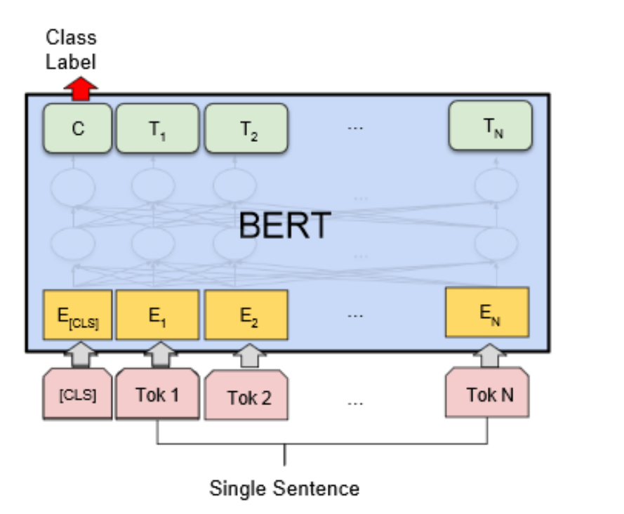

# Sentimental Classifier

> with KoBERT (SKT Brain)


## Requirement

>- Python >= 3.6
>- PyTorch >= 1.7.0
>- MXNet >= 1.4.0
>- gluonnlp >= 0.6.0
>- sentencepiece >= 0.1.6
>- onnxruntime >= 0.3.0
>- transformers >= 3.5.0

```
git clone https://github.com/SKTBrain/KoBERT.git
cd KoBERT
pip install -r requirements.txt
pip install .
```


## 데이터셋

AIHUB 감성대화 말뭉치 (2020): 27만 문장

> 60가지의 감정분류를 일상대화에 필요한 대표적인 감정으로 통일하여 사용하였다.
>
> anger = 분노, 상처
>
> sadness = 슬픔
>
> happiness = 기쁨
>
> 감성 말뭉치는 크게 세 분류로 통일하였음

국립국어원 모두의 말뭉치 구어: 2000만 문장 중, 14만 문장 이용 

> 평서문 분류를 위해 구어체 말뭉치를 사용하여 구성하였다.

Trainset : Testset = 0.9 : 0.1


## 학습 파라미터

```
max_len = 64

batch_size = 64

warmup_ratio = 0.1

num_epochs = 10

max_grad_norm = 1

log_interval = 200

learning_rate = 5e-5

optimizer = 'AdamW'
```


## 구조



BERT모델의 pooler(첫 Class Label)를 받아 Fully connected Layer하나를 추가한 구조로 구성

가장 높은 인덱스를 감정이랑 매핑하여 감정 분류하는데 사용


### 결과

Accuracy: 82%