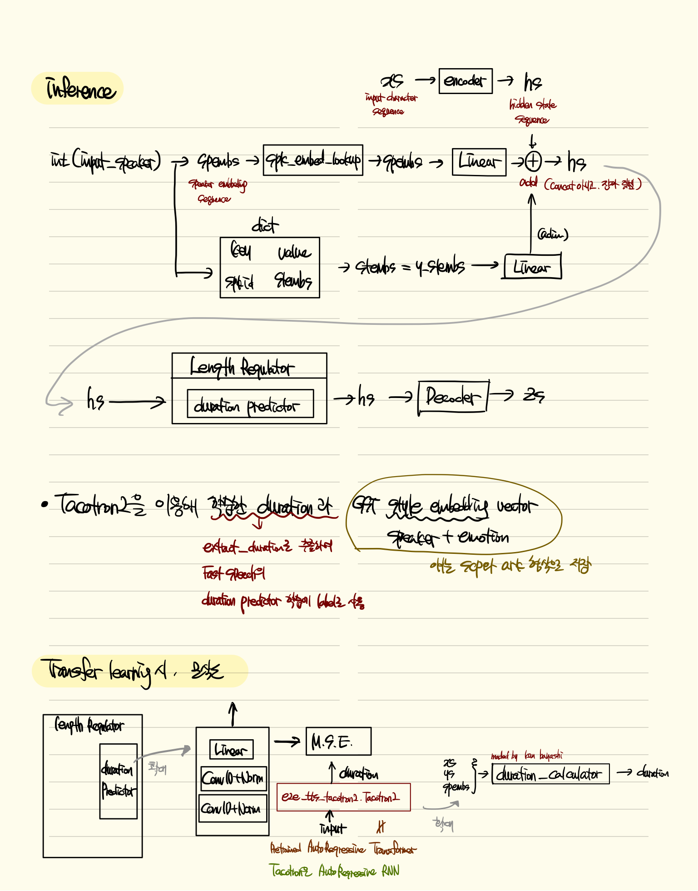

# E2E MultiSpeaker MultiEmotionTTS

```
ESPNET 0.7.0
pytorch 19.0
cuda 11.1
cudnn 8.0.5
vga: rtx 3080
```


``` sh
pip install jamo
git clone -q https://github.com/kan-bayashi/espnet.git #-b fix_import
cd espnet && git fetch && git checkout -b v.0.7.0 4ad3247c850bb6696e4e2c3f7633c0153463dded
```


```sh
# Download pre trained model

# fastspeech pretrained model
espnet/utils/download_from_google_drive.sh \
       https://drive.google.com/open?id=14JKGJ5lfM6ATaavDAlJyCGA81BAden9x downloads/ptFastSpeech tar.gz
# parallel waveGAN pretrained model       
espnet/utils/download_from_google_drive.sh \
        https://drive.google.com/open?id=1GVVG9lw6Aq2a-C6au7KCMtp186GtsXrk downloads/ptParallelWavegan tar.gz
```


```sh
# install kaldi

git clone https://github.com/kaldi-asr/kaldi
cd kaldi/tools
make -j <NUM-CPU>
sudo ./extras/install_mkl.sh
# 문제가 발생한다면 https://github.com/kusw1006/studyZeroth/tree/main/opt/kaldi/src 참고
cd ../src
./configure
make -j clean depend; make -j <NUM-CPU>
cd ../..
```


## 0. 전체구조


## 1. Text2mel

### 1-1. Tacotron2, GST


> Tacotron2는 Text2Mel을 진행해주는 seq2seq모델의 구조를 기반으로 하는 Network이다. 
>
> 문자 임베딩을 mel scale spectrogram에 맵핑하는 반복적인 seq2seq의 예측 네트워크로 구성되며, 
>
> 전체적인 구조는 Encoder와 Deocde 그리고 둘을 연결하는 Attention으로 구성되어있다. 
>
> Tacotron2는 기존의 Tacotron의 Convolution bank highway network GRU (CBHG) 대신 인코더 및 디코더에서 Bidirectional LSTM Convolutional layer들을 사용해 비교적 단순한 구조로 만든 구조이며
>
> - 인코더의 특징은 최종 Conv Layers를 통과한 유닛들이 BiLSTM으로 연결되어있으며 이를통해 인코딩 도니 특징을 생성, 
>
> - 디코더의 특징은 입력 시퀀스로부터 mel-spectrogram을 예측하는 Autoregressive RNN을 포함
> - Attention은 time-step에 대해 최적화하기 위해 location-sensitive attention을 사용.


> Tacotron2에서 학습을 진행한 뒤
>
> FastSpeech에게 Tacotron2에서 학습으로 구한 duration weight를 전달하여 전이학습을 진행하며
>
> Tacotron2-GST에서 embedding speaker+emotion style vector를 kaldi style의 scirpt, archive 형식으로 저장하여 추후 Fastspeech inference시에 임베딩 벡터를 add하여 사용할 예정


[Tacotron2] https://github.com/tensorspeech/TensorFlowTTS/tree/master/examples/tacotron2

[GST]  https://github.com/KinglittleQ/GST-Tacotron/blob/master/GST.py


### 1-2. FastSpeech




> Feed Forward Transformer(FFT)를 encoder와 decoder로 사용하며, positional encoding을 이용해 Non-regressive 하게 text2Mel을 진행하여 훨씬 더 빠른 추론속도를 가지고 있다 (결과는 아래 첨부).
>
> Encoder 단의 FFT를 통과한 뒤, Length Regulator를 통해 encoding된 Mel-spectrogram과 음소 길이를 alignment하는데 이때 duration 정보를 사전에 학습한 AutoRegressiveRNN(Tacotron2)의 duration을 label로 하여 최소제곱오차를 구하는 방식으로 Transfer learning을 하여 사용한다.


## 2. Mel2wave

### 2-1. Parallel WaveGAN


보조(Auxiliary) feature == mel-spectrogram


#### 2-1-1. 사용이유

>1.44M의 매개변수를 가지며, 단일 GPU 환경에서 실시간보다 28.68배 빠른 24kHz 음성 파형을 생성할 수 있는 모델을 선택하였다.
>
> Perceptual listening test results
>verify that our proposed method achieves 4.16 mean opinion score
>within a Transformer-based text-to-speech framework, 또한 성능또한 좋다


> 보코더 기술의 대표적인 방식에는 WaveNet과 WaveRNN 등이 있다. WaveNet은 이전 샘플을 이용하여
>
> 현재 샘플의 확률분포를 예측하는 자기회귀 방식을 적용하여[7], 합성할 때 음성 샘플의 예측을 순차적으로 처리하므로 시간이 매우 오래 걸린다[8]. 
>
> 다른 모델들은 현재의 음성 샘플을 예측하기 위하여 이전의 샘플을 이용하는 자기회귀 방식을 적용한다.
> 이와 같이 음성신호를 병렬로 생성하지 않고 직렬로 예측하는 연산 특성은 GPU의 병렬 가속 연산 기능을 활용하지 못하여 합성 시간이 오래 걸리는 단점을 갖는다. 
>
> 따라서 합성음의 품질이 우수하더라도 실시간 처리가 요구되는 환경에서 사용하기 어렵다.
> 자기회귀 방식으로 음성 샘플을 생성하는 방식과 달리, 비-자기회귀(Non-autoregressive) 방식은 이전에
> 생성된 샘플에 의존하지 않고 병렬로 음성 샘플을 생성할 수 있어 음성 합성 처리 속도를 개선할 수 있다. 


> 실시간 처리는 자율 주행차, 로봇 등 임베디드 환경에서 필수적인 요소이므로, 비-자기회귀 모델인 Parallel WaveGAN 모델을 선택하게되었다. 


#### 2-2-2. Model 출처

> Korean Vocoder은 다음의 github의 Pretrained model을 사용하였다.

```
/espnet/utils/download_from_google_drive.sh \
        https://drive.google.com/open?id=1GVVG9lw6Aq2a-C6au7KCMtp186GtsXrk downloads/ptParallelWavegan tar.gz
```

[출처] https://github.com/emotiontts/emotiontts_open_db/tree/master/Codeset/Transformer-ParallelWaveGAN-based-Korean-TTS-master


## 3. 결과

### 3-1. MOS

|           | 동기1 | 동기2 | 동기3 | 동기4 | 동기5 | …    |      | 평균 |
| --------- | ----- | ----- | ----- | ----- | ----- | ---- | ---- | ---- |
| Neutral   | 4     | 3     | 3     | 5     | 4     |      |      |      |
| Anger     |       |       |       |       |       |      |      |      |
| Sadness   |       |       |       |       |       |      |      |      |
| Happiness |       |       |       |       |       |      |      |      |

|           | TPR(true positive rate) | TNR(true negative rate) | Accuracy |
| --------- | ----------------------- | ----------------------- | -------- |
| neutral   |                         |                         |          |
| anger     |                         |                         |          |
| sadness   |                         |                         |          |
| happiness |                         |                         |          |


### 3-2. 속도

>18.5시간 13000개의 발화, sample rate = 22050, 16bit 양자화 데이터, 학습에 12950개 문장, 검증용으로 50개 사용하여 학습했을때 Fastspeech가 text2mel에서 가장 빨랐으며 대략 아래와 같은 성능이 나온다.

